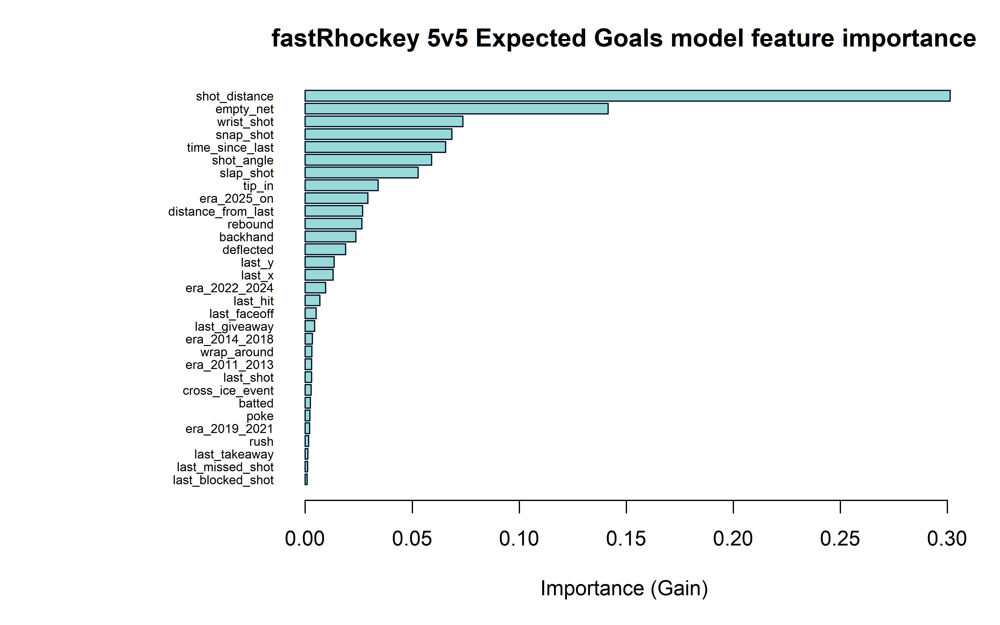
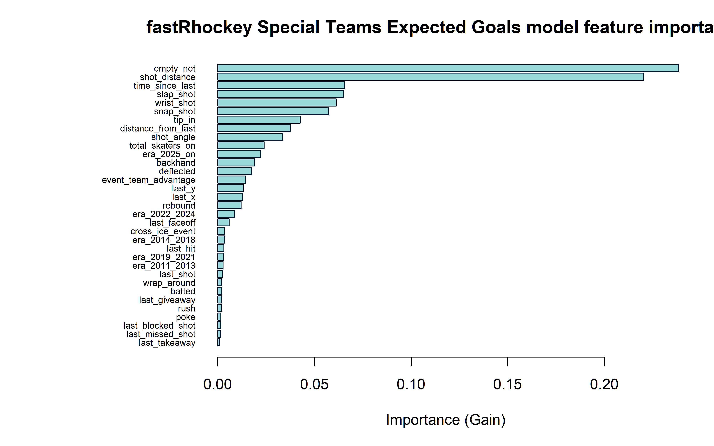

```{r setup, include=FALSE}
knitr::opts_chunk$set(
  echo = TRUE,
  message = FALSE,
  warning = FALSE,
  fig.path = "README_files/figure-gfm/",
  dpi = 150
)
suppressPackageStartupMessages(library(janitor))
```

# fastRhockey Expected Goals Model

This repository contains the expected goals (xG) model built on
[fastRhockey](https://github.com/sportsdataverse/fastRhockey) NHL play-by-play
data. The model follows the same general approach as the
[hockeyR expected goals model](https://github.com/danmorse314/hockeyR-models)
[@hockeyR-xg] but is retrained on a larger dataset spanning 16 NHL seasons
(2010-11 through 2025-26) and uses an expanded set of five era groupings to
capture rule changes over the longer time horizon.

Expected goals models attempt to quantify the probability of any given unblocked
shot becoming a goal, based on contextual information about the shot: where it was
taken, how it was taken, and what happened immediately prior. The resulting xG
values are useful for evaluating player and team performance beyond raw goal
counts.

## Data

The play-by-play data used to train this model comes from the
[fastRhockey-nhl-data](https://github.com/sportsdataverse/fastRhockey-nhl-data)
repository, originally sourced via the
[fastRhockey](https://github.com/sportsdataverse/fastRhockey) R package
[@fastRhockey]. The data is stored as `.rds` files in
`nhl/pbp/full/rds/`.

```{r load-data}
suppressPackageStartupMessages({
    library(dplyr)
    library(tidyr)
    library(stringr)
    library(ggplot2)
    library(readr)
    library(purrr)
    library(scales)
})

# Load all 16 seasons of PBP data
rds_dir <- "nhl/pbp/full/rds"
rds_files <- list.files(rds_dir, pattern = "\\.rds$", full.names = TRUE)

# Read all files into a list, then harmonise column types before binding.
# The old API (2010-2022) and new API (2023+) store some columns as different
# types (e.g. season: integer vs character, game_date: Date vs character).
# bind_rows handles integer↔double promotion automatically; we only need to
# fix truly incompatible pairs (character↔integer, Date↔character).
pbp_list <- map(rds_files, function(f) {
    df <- readRDS(f)
    # Fix character↔integer mismatches (old API stores as character, new as integer)
    df$season  <- as.character(df$season)
    df$home_id <- as.character(df$home_id)
    df$away_id <- as.character(df$away_id)
    # Strip 'glue' subclass from description (new API) so bind_rows sees plain character
    if ("description" %in% names(df)) df$description <- as.character(df$description)
    # Fix Date↔character mismatch on game_date
    if (is.character(df$game_date)) df$game_date <- as.Date(df$game_date)
    # Coerce any remaining logical columns that clash with integer/numeric
    # (empty_net, for example, is logical in some files and integer in others)
    for (col in names(df)) {
        if (is.logical(df[[col]])) df[[col]] <- as.integer(df[[col]])
    }
    df
})

pbp_all <- bind_rows(pbp_list)
rm(pbp_list)  # free memory
gc()  # reclaim ~10 GB from the list

# --- Column harmonisation across seasons ---
# event_team (full name) and event_team_abbr exist in all seasons.
# home_name / away_name exist everywhere; create home_team / away_team aliases
# so that event_team == home_team comparisons work.
pbp_all <- pbp_all %>%
    mutate(
        home_team = home_name,
        away_team = away_name
    )

# Helper to pretty-print season codes ("20102011" -> "2010-2011")
format_season <- function(s) paste0(substr(s, 1, 4), "-", substr(s, 5, 8))

seasons <- sort(unique(pbp_all$season))
n_rows <- nrow(pbp_all)
n_seasons <- length(seasons)

cat(sprintf(
    "Loaded %s play-by-play rows across %d seasons (%s through %s)\n",
    format(n_rows, big.mark = ","), n_seasons,
    format_season(min(seasons)), format_season(max(seasons))
))
```

### Strength States

The NHL play-by-play data records the number of skaters on the ice for each
team at the time of every event. As with most expected goals models, shots taken
in different strength states need special handling.

```{r strength-states}
# Define Fenwick events (unblocked shots only)
fenwick <- c("SHOT", "MISSED_SHOT", "GOAL")

# Investigate strength states of all Fenwick events
strength_summary <- pbp_all %>%
    filter(event_type %in% fenwick & !is.na(strength_state)) %>%
    count(strength_state, sort = TRUE) %>%
    mutate(pct = round(100 * n / sum(n), 2))

knitr::kable(
    head(strength_summary, 15),
    col.names = c("Strength State", "Count", "Pct (%)"),
    align = "lrr"
)
```

The vast majority of Fenwick events occur at 5-on-5. For this model, a small
number of events at unusual strength states (e.g. 6v3) and those with missing
strength state information were removed from the training data. Penalty shots
and shootout attempts were also excluded — shootouts are not assigned an xG
value since they don't count as official goals, and penalty shots were assigned
a constant xG of ~0.32, reflecting the ~32% conversion rate across all penalty
shot and shootout attempts in the dataset.

Events with missing critical features (shot location, shot type) were also
removed, as were blocked shots. Blocked shots are excluded because the NHL
records the *location of the block*, not the location of the shooter, making the
distance and angle calculations unreliable.[^1]

[^1]: Unblocked shots are often referred to as "Fenwick," named after Matt
    Fenwick, who proposed that blocked shots are worse scoring chances than
    unblocked shots and don't add value to analysis. Read more
    [here](https://www.pensionplanpuppets.com/2012/7/25/3184137/intro-to-advanced-hockey-statistics-fenwick).

## Feature Selection

There are several excellent public xG models with readily available details:

- Asmae Toumi and Dawson Sprigings created an [even-strength model](https://hockey-graphs.com/2015/10/01/expected-goals-are-a-better-predictor-of-future-scoring-than-corsi-goals/) with rush chance and rebound identifiers. [@hockey-graphs-xg]

- Matthew Barlowe's [public model](https://rstudio-pubs-static.s3.amazonaws.com/311470_f6e88d4842da46e9941cc6547405a051.html) covers all strengths and takes team strength as a variable. [@barlowe-xg]

- Peter Tanner's [MoneyPuck.com model](https://moneypuck.com/about.htm) utilizes information from the events immediately prior to the shot. [@moneypuck-xg]

- Josh and Luke Younggren of [evolving-hockey.com](https://evolving-hockey.com/) made [four separate models](https://rpubs.com/evolvingwild/395136/) for different strength states. [@evolving-wild-xg]

All models agree that shot distance is the most important feature, with shot
angle close behind. The `fastRhockey` model uses features similar to those listed
above: distance and angle, rebound and rush chance classifiers, information about
the prior event, and a `cross_ice_event` flag to indicate the goaltender had to
move laterally across the crease.

### Two-Model Architecture

Following `hockeyR` [@hockeyR-xg] and in the spirit of the Younggren models
[@evolving-wild-xg], the `fastRhockey` xG model is split into two separate
models:

1. **5-on-5 model** — exclusively for 5-on-5 play
2. **Special teams model** — for all other non-5v5 situations (power play,
   shorthanded, 4-on-4, 3-on-3, extra attacker, etc.)

The 4-on-4 and 3-on-3 situations are included in the special teams model
rather than the 5v5 model because the increased open ice more closely resembles
special teams play than the structured chaos of 5-on-5.

```{r goals-by-strength, fig.width=8, fig.height=5, fig.alt="NHL shooting percentages vary significantly by strength state. 4-on-4 and 3-on-3 strength states more closely resemble special teams shooting percentages."}
real_strengths <- c(
    "5v5", "4v4", "3v3",
    "5v4", "5v3", "4v3", "6v4", "6v5",
    "4v5", "3v5", "3v4", "4v6", "5v6"
)

strength_goals <- pbp_all %>%
    filter(strength_state %in% real_strengths & event_type %in% fenwick) %>%
    # Remove empty-net shots for clean comparison
    filter(str_detect(strength_state, "v6", negate = TRUE) &
               strength_state != "6v3") %>%
    group_by(strength_state) %>%
    summarise(
        sog = sum(event_type %in% c("SHOT", "GOAL")),
        goals = sum(event_type == "GOAL"),
        .groups = "drop"
    ) %>%
    mutate(
        sh_perc = round(100 * goals / sog, 2),
        strength = case_when(
            strength_state %in% c("5v5", "4v4", "3v3") ~ "Even Strength",
            strength_state %in% c("3v4", "3v5", "4v5") ~ "Shorthanded",
            strength_state %in% c("5v4", "5v3", "4v3", "6v4") ~ "Power Play",
            TRUE ~ "Extra Attacker"
        )
    )

ggplot(strength_goals, aes(reorder(strength_state, -sh_perc), sh_perc)) +
    geom_col(aes(fill = strength)) +
    scale_fill_manual(values = c("#E69F00", "#999999", "#56B4E9", "#009E73")) +
    theme_bw() +
    guides(fill = guide_legend(ncol = 2)) +
    theme(
        legend.background = element_rect(color = "black"),
        legend.position = c(.75, .75)
    ) +
    labs(
        x = NULL, y = "Shooting %", fill = NULL,
        caption = "data from fastRhockey-nhl-data",
        title = "Shooting % by game strength state",
        subtitle = sprintf("%s through %s NHL seasons",
                           format_season(min(seasons)),
                           format_season(max(seasons)))
    )
```

The special teams model includes two additional features to capture the strength
state: `total_skaters_on` (total skaters on ice, a proxy for available space)
and `event_team_advantage` (shooting team's skater count minus opposing team's
skater count). For example, a power play shot at 5-on-3 has `total_skaters_on`
= 8 and `event_team_advantage` = 2.

### 5v5 Features

| Feature              | Description                                                         |
| :------------------- | :------------------------------------------------------------------ |
| `shot_distance`      | Distance from shooter to net (ft)                                   |
| `shot_angle`         | Angle between shooter and net (degrees)                             |
| `shot_type`          | Wrist, Slap, Snap, Backhand, Tip-In, Deflected, Wrap-Around, Cradle |
| `rebound`            | Binary: previous event was a Fenwick event within 2 seconds         |
| `rush`               | Binary: previous event was in NZ/DZ within 4 seconds                |
| `last_event_type`    | Type of the previous play-by-play event                             |
| `time_since_last`    | Seconds elapsed since the previous event                            |
| `distance_from_last` | Distance from the previous event location (ft)                      |
| `cross_ice_event`    | Binary: goalie had to move laterally across crease                  |
| `empty_net`          | Binary: opposing net was empty                                      |
| `last_x`, `last_y`   | Coordinates of the previous event                                   |
| `era_*`              | Five era dummy variables (see below)                                |

### Special Teams Additional Features

| Feature                | Description                                       |
| :--------------------- | :------------------------------------------------ |
| `total_skaters_on`     | Total skaters on ice for both teams               |
| `event_team_advantage` | Shooting team skaters minus opposing team skaters |

### Era Groupings

Borrowing the era concept from `nflfastR` [@nflfastR] and its expected points
model, the `fastRhockey` model uses five era groupings to account for changes
in goal-scoring rates driven by NHL rule changes:

| Era             | Seasons                 | Rule Change                                                                                                                  |
| :-------------- | :---------------------- | :--------------------------------------------------------------------------------------------------------------------------- |
| `era_2011_2013` | 2010-11 through 2012-13 | Pre-equipment reduction baseline                                                                                             |
| `era_2014_2018` | 2013-14 through 2017-18 | [Goaltender leg pad size reduction](https://www.nhl.com/news/nhl-goalies-to-use-shorter-leg-pads-in-2013-14/c-680812)        |
| `era_2019_2021` | 2018-19 through 2020-21 | [Goalie chest & arm protector reduction](https://www.nhl.com/news/nhl-nhlpa-add-chest-arm-pad-rules-for-goalies/c-300172856) |
| `era_2022_2024` | 2021-22 through 2023-24 | [Cross-checking penalty emphasis](https://twitter.com/PR_NHL/status/1441493080637689859)                                     |
| `era_2025_on`   | 2024-25 and beyond      | Latest rules and trends                                                                                                      |

This is an expansion over the original `hockeyR` model's four eras, adding a
fifth era to capture the most recent seasons as the dataset has grown. Patrick
Bacon's expected goals model [@topdownhockey-xg] also accounts for rule changes,
though Bacon trains on smaller rolling windows near each season rather than using
era dummy variables.

### Feature Importance

Once the final models were trained, feature importance plots were generated. As
with every other model mentioned above, shot distance is the dominant feature.





## Model Building and Tuning

For full implementation details, see `R/build_xg_model.R` in this repository.
The model was built with extreme gradient boosting using the `xgboost` R
package [@xgboost]. Rachael Tatman provides a great overview of how XGBoost
models work [here](https://www.kaggle.com/code/rtatman/machine-learning-with-xgboost-in-r/notebook).
[@xgboost-tutorial]

The 16 seasons of data were randomly split into training and testing sets at
the game level — all events from any given game are in the same set to prevent
data leakage from sequential event features. A modified random grid search
was used to tune hyperparameters with 5-fold cross validation.

The final model performance:

| Model | CV Log-loss | CV AUC |
| :---: | :---------: | :----: |
|  5v5  |   0.2053    | 0.8322 |
|  ST   |   0.2567    | 0.8213 |

Both log-loss and AUC are between 0 and 1. A *lower* log-loss is better; a
*higher* AUC is better. Gaurav Dembla provides great resources on interpreting
[log-loss](https://towardsdatascience.com/intuition-behind-log-loss-score-4e0c9979680a)
[@logloss-intro] and
[AUC](https://towardsdatascience.com/intuition-behind-roc-auc-score-1456439d1f30)
[@auc-intro].

## Results

With the models finalized, they can be applied to every season in the dataset.
To validate the model, we can look at how well expected goals track actual goals
at the player and team levels.

```{r apply-xg}
# Load saved models and apply xG to the full dataset
model_meta <- readRDS("models/xg_model_meta.rds")

model_5v5 <- xgboost::xgb.load("models/xg_model_5v5.json")
model_st <- xgboost::xgb.load("models/xg_model_st.json")

# Shot type normalization — same mapping used in training
normalize_shot_type <- function(x) {
    case_when(
        x %in% c("Wrist Shot", "WRIST SHOT", "Wrist", "wrist")          ~ "Wrist Shot",
        x %in% c("Slap Shot", "SLAP SHOT", "Slap", "slap")             ~ "Slap Shot",
        x %in% c("Snap Shot", "SNAP SHOT", "Snap", "snap")              ~ "Snap Shot",
        x %in% c("Backhand", "BACKHAND", "backhand")                    ~ "Backhand",
        x %in% c("Tip-In", "TIP-IN", "Tip In", "Tip", "tip-in")        ~ "Tip-In",
        x %in% c("Deflected", "DEFLECTED", "Deflection", "deflected")   ~ "Deflected",
        x %in% c("Wrap-Around", "WRAP-AROUND", "Wrap-around",
                  "Wraparound", "wrap-around")                           ~ "Wrap-around",
        x %in% c("Cradle", "CRADLE", "cradle")                          ~ "Cradle",
        x %in% c("Bat", "BAT", "bat", "Batted", "batted")                ~ "Batted",
        x %in% c("Between Legs", "BETWEEN LEGS", "between-legs")        ~ "Between Legs",
        x %in% c("Poke", "POKE", "poke")                                ~ "Poke",
        TRUE ~ x
    )
}

# Prepare features for xG prediction
pbp_xg <- pbp_all %>%
    filter(event_type %in% fenwick & !is.na(strength_state)) %>%
    filter(is.na(period_type) | period_type != "SHOOTOUT") %>%
    filter(
        !tolower(secondary_type) %in% c("penalty shot", "penalty-shot") |
        is.na(secondary_type)
    ) %>%
    group_by(game_id) %>%
    arrange(event_id, .by_group = TRUE) %>%
    mutate(
        last_event_type = lag(event_type),
        time_since_last = game_seconds - lag(game_seconds),
        last_x = lag(x),
        last_y = lag(y),
        distance_from_last = round(sqrt(((y - last_y)^2) + ((x - last_x)^2)), 1),
        event_zone = case_when(
            x >= -25 & x <= 25 ~ "NZ",
            (x_fixed < -25 & event_team == home_team) |
                (x_fixed > 25 & event_team == away_team) ~ "DZ",
            (x_fixed > 25 & event_team == home_team) |
                (x_fixed < -25 & event_team == away_team) ~ "OZ"
        ),
        last_event_zone = lag(event_zone),
        rebound = ifelse(
            last_event_type %in% fenwick & time_since_last <= 2, 1, 0
        ),
        rush = ifelse(
            last_event_zone %in% c("NZ", "DZ") & time_since_last <= 4, 1, 0
        ),
        cross_ice_event = ifelse(
            last_event_zone == "OZ" &
                ((lag(y) > 3 & y < -3) | (lag(y) < -3 & y > 3)) &
                time_since_last <= 2, 1, 0
        ),
        shot_type = normalize_shot_type(secondary_type),
        empty_net = ifelse(is.na(empty_net) | empty_net == FALSE, 0, 1),
        goal = ifelse(event_type == "GOAL", 1, 0),
        event_team_skaters = ifelse(
            event_team == home_team, home_skaters, away_skaters
        ),
        opponent_team_skaters = ifelse(
            event_team == home_team, away_skaters, home_skaters
        ),
        total_skaters_on = event_team_skaters + opponent_team_skaters,
        event_team_advantage = event_team_skaters - opponent_team_skaters
    ) %>%
    ungroup() %>%
    mutate(
        # Era dummies (season format: "20102011", "20112012", etc.)
        era_2011_2013 = ifelse(
            season %in% c("20102011", "20112012", "20122013"), 1, 0
        ),
        era_2014_2018 = ifelse(
            season %in% c("20132014", "20142015", "20152016",
                          "20162017", "20172018"), 1, 0
        ),
        era_2019_2021 = ifelse(
            season %in% c("20182019", "20192020", "20202021"), 1, 0
        ),
        era_2022_2024 = ifelse(
            season %in% c("20212022", "20222023", "20232024"), 1, 0
        ),
        era_2025_on = ifelse(
            season %in% c("20242025", "20252026"), 1, 0
        )
    ) %>%
    # Remove rows with missing critical features
    filter(
        !is.na(shot_distance) & !is.na(shot_angle) &
        !is.na(shot_type) & !is.na(last_event_type)
    ) %>%
    # Keep only valid last_event_type values (same filter as training)
    filter(last_event_type %in% c(
        "FACEOFF", "GIVEAWAY", "TAKEAWAY", "BLOCKED_SHOT", "HIT",
        "MISSED_SHOT", "SHOT", "STOP", "PENALTY", "GOAL"
    )) %>%
    # Drop rows with NA in any numeric feature (same as training na.omit)
    filter(
        !is.na(time_since_last) & !is.na(distance_from_last) &
        !is.na(last_x) & !is.na(last_y) &
        !is.na(rebound) & !is.na(rush) & !is.na(cross_ice_event)
    )

# Get expected feature names from saved metadata
feats_5v5 <- model_meta$xg_feature_names_5v5
feats_st <- model_meta$xg_feature_names_st

# Valid strength states for ST model
st_strengths <- c(
    "5v4", "5v3", "6v5", "6v4", "4v4", "4v3",
    "3v3", "4v5", "3v5", "5v6", "4v6", "3v4"
)

# Split into 5v5 and ST datasets
data_5v5 <- pbp_xg %>% filter(strength_state == "5v5")
data_st <- pbp_xg %>% filter(strength_state %in% st_strengths)

# One-hot encode using pivot_wider + clean_names (same as training)
encode_and_predict <- function(df, model, feature_names) {
    feat_df <- df %>%
        mutate(row_id = row_number()) %>%
        select(
            row_id,
            starts_with("era_"),
            shot_distance, shot_angle, rebound, rush,
            time_since_last, distance_from_last, cross_ice_event,
            empty_net, last_x, last_y,
            shot_type, last_event_type,
            any_of(c("total_skaters_on", "event_team_advantage"))
        ) %>%
        mutate(type_value = 1, last_value = 1) %>%
        pivot_wider(
            names_from = shot_type,
            values_from = type_value,
            values_fill = 0
        ) %>%
        pivot_wider(
            names_from = last_event_type,
            values_from = last_value,
            values_fill = 0,
            names_prefix = "last_"
        ) %>%
        clean_names() %>%
        arrange(row_id) %>%
        select(-row_id)

    # Ensure every expected feature column exists (fill missing with 0)
    for (f in feature_names) {
        if (!f %in% names(feat_df)) feat_df[[f]] <- 0
    }

    mat <- as.matrix(feat_df[, feature_names])
    dmat <- xgboost::xgb.DMatrix(mat)
    predict(model, dmat)
}

data_5v5$xg <- encode_and_predict(data_5v5, model_5v5, feats_5v5)
data_st$xg <- encode_and_predict(data_st, model_st, feats_st)

# Combine back together
pbp <- bind_rows(data_5v5, data_st)

cat(sprintf(
    "Applied xG to %s Fenwick events (%s 5v5 + %s ST)\n",
    format(nrow(pbp), big.mark = ","),
    format(nrow(data_5v5), big.mark = ","),
    format(nrow(data_st), big.mark = ",")
))
```

### Player-Level Validation

The relationship between player-level expected goals and actual goals scored
provides a strong validation of the model.

```{r player-xg-plot, fig.width=7, fig.height=6, fig.alt="Player-level goal scoring is highly correlated with player-level expected goals"}
player_goals <- pbp %>%
    filter(season_type %in% c("R", "REG") & period < 5) %>%
    filter(event_type %in% fenwick) %>%
    group_by(player = event_player_1_name, season) %>%
    summarise(
        fenwick = n(),
        goals = sum(event_type == "GOAL", na.rm = TRUE),
        xg = sum(xg, na.rm = TRUE),
        .groups = "drop"
    ) %>%
    mutate(gax = goals - xg) %>%
    filter(goals > 0)

goal_mod <- lm(goals ~ xg, data = player_goals)
rsq_player <- summary(goal_mod)$r.sq %>% round(3)

ggplot(player_goals, aes(xg, goals)) +
    geom_abline(slope = 1, intercept = 0, linetype = "dashed") +
    geom_point(alpha = .2) +
    geom_smooth(method = lm, color = "red", se = TRUE) +
    annotate("text", x = 3, y = 22, label = paste("R\u00b2:", rsq_player),
             color = "red", size = 5) +
    scale_x_continuous(breaks = seq(0, 60, 10)) +
    scale_y_continuous(breaks = seq(0, 60, 10)) +
    theme_bw() +
    labs(
        x = "Expected Goals", y = "Observed Goals",
        caption = "data from fastRhockey-nhl-data",
        title = "Player season goal totals vs expectation",
        subtitle = sprintf(
            "%s through %s seasons | all situations",
            format_season(min(seasons)), format_season(max(seasons))
        )
    )
```

### Team-Level Validation

Performing the same analysis at the team level yields a strong correlation as
well.

```{r team-xg-plot, fig.width=7, fig.height=6, fig.alt="Team-level goal scoring is highly correlated with team-level expected goals"}
team_goals <- pbp %>%
    filter(season_type %in% c("R", "REG") & period < 5) %>%
    filter(event_type %in% fenwick) %>%
    group_by(team = event_team_abbr, season) %>%
    summarise(
        fenwick = n(),
        goals = sum(event_type == "GOAL", na.rm = TRUE),
        xg = sum(xg, na.rm = TRUE),
        .groups = "drop"
    ) %>%
    mutate(gax = goals - xg)

team_goal_mod <- lm(goals ~ xg, data = team_goals)
rsq_team <- summary(team_goal_mod)$r.sq %>% round(3)

ggplot(team_goals, aes(xg, goals)) +
    geom_abline(slope = 1, intercept = 0, linetype = "dashed") +
    geom_point(alpha = .4) +
    geom_smooth(method = lm, color = "red", se = TRUE) +
    annotate("text", x = min(team_goals$xg) + 10, y = max(team_goals$goals) - 10,
             label = paste("R\u00b2:", rsq_team), color = "red", size = 5) +
    theme_bw() +
    labs(
        x = "Expected Goals", y = "Observed Goals",
        caption = "data from fastRhockey-nhl-data",
        title = "Team season goal totals vs expectation",
        subtitle = sprintf(
            "%s through %s seasons | all situations",
            format_season(min(seasons)), format_season(max(seasons))
        )
    )
```

### Calibration

Borrowing from `nflfastR` [@nflfastR] (and `nflscrapR` [@Yurko2018]), a
calibration plot shows how well the model's predicted probabilities match
observed goal rates across different probability bins.

```{r xg-calibration-plot, fig.width=7, fig.height=6, fig.alt="The expected goals model calibrates well for low-danger shots but tends to slightly undervalue high-danger scoring chances"}
xg_bin_plot <- pbp %>%
    filter(!is.na(xg) & event_type %in% fenwick) %>%
    filter(season_type %in% c("R", "REG") & period < 5) %>%
    mutate(xg_bin = round(xg / 0.05) * 0.05) %>%
    group_by(xg_bin) %>%
    summarise(
        fenwick = n(),
        goals = sum(event_type == "GOAL"),
        .groups = "drop"
    ) %>%
    mutate(obs_goal_prob = goals / fenwick)

ggplot(xg_bin_plot, aes(xg_bin, obs_goal_prob)) +
    geom_abline(slope = 1, intercept = 0, linetype = "dashed") +
    geom_point(aes(size = fenwick)) +
    scale_size_continuous(
        breaks = c(10000, 20000, 40000, 60000, 80000),
        labels = c("10k", "20k", "40k", "60k", "80k")
    ) +
    geom_smooth() +
    coord_equal() +
    scale_x_continuous(limits = c(0, 1)) +
    scale_y_continuous(limits = c(0, 1)) +
    theme_bw() +
    labs(
        x = "Estimated goal probability", y = "Observed goal probability",
        caption = "data from fastRhockey-nhl-data",
        size = "Unblocked\nShots",
        subtitle = sprintf(
            "%s through %s seasons | all situations",
            format_season(min(seasons)), format_season(max(seasons))
        ),
        title = "xG Calibration"
    )
```

### Season-Level xG per Goal

Checking the total expected goal count against observed goals by season shows
how well the model tracks actual scoring rates. A ratio near 1.0 indicates the
model is well-calibrated overall.

```{r xg-per-goal}
xg_per_goal <- pbp %>%
    filter(season_type %in% c("R", "REG") & period < 5) %>%
    group_by(season) %>%
    summarise(
        goals = sum(event_type == "GOAL"),
        xg = sum(xg, na.rm = TRUE),
        .groups = "drop"
    ) %>%
    mutate(
        xg_per_g = round(xg / goals, 3),
        xg = round(xg, 1),
        season = format_season(season)
    ) %>%
    select(season, goals, xg, xg_per_g)

knitr::kable(
    xg_per_goal,
    col.names = c("Season", "Goals", "xG", "xG per Goal"),
    align = "lrrr"
)

overall_ratio <- round(sum(xg_per_goal$xg) / sum(xg_per_goal$goals), 3)
cat(sprintf(
    "\nOverall: %.3f expected goals per observed goal across all seasons\n",
    overall_ratio
))
```

## Model Details

### Penalty Shots

Penalty shots and shootout attempts are handled separately from the two xgboost
models. All penalty shot and shootout attempts across the dataset were assigned
a constant xG value reflecting the observed conversion rate:

```{r penalty-shots}
ps_data <- pbp_all %>%
    filter(
        event_type %in% fenwick &
        (tolower(secondary_type) %in% c("penalty shot", "penalty-shot") |
         period_type %in% "SHOOTOUT")
    )

ps_goals <- sum(ps_data$event_type == "GOAL")
ps_total <- nrow(ps_data)
ps_rate <- round(ps_goals / ps_total, 4)

cat(sprintf(
    "Penalty shot / shootout conversion: %d goals on %s attempts = %.2f%%\n",
    ps_goals, format(ps_total, big.mark = ","), 100 * ps_rate
))
```

### Reproducibility

The complete training code is available in `R/build_xg_model.R`. The trained
models are saved in `models/` as:

- `xg_model_5v5.json` — XGBoost model for 5-on-5 play
- `xg_model_st.json` — XGBoost model for special teams
- `xg_model_meta.rds` — Metadata (penalty shot constant, feature lists, training date)

Cross-validation results are saved in `data/`:

- `cv_results_5v5_final.rds` — 5v5 CV evaluation log
- `cv_results_st_final.rds` — ST CV evaluation log

## References
