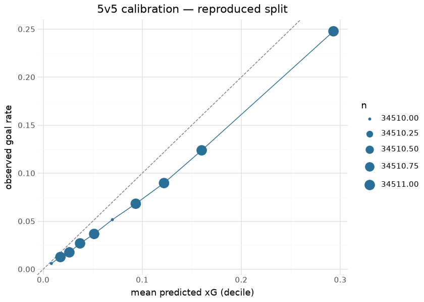
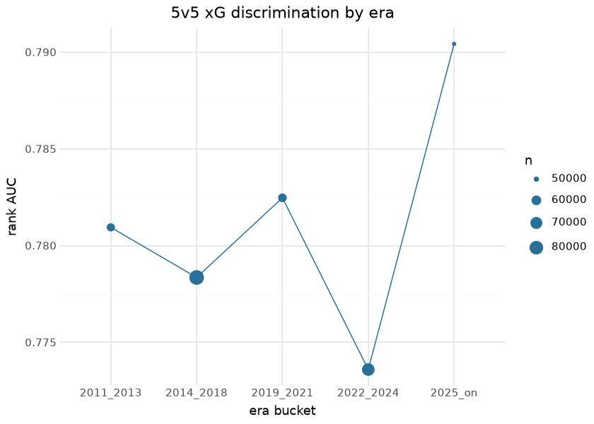

# NHL Expected Goals (fastRhockey xG suite)

The fastRhockey xG suite estimates the probability that an unblocked
shot becomes a goal, in two strength regimes: **5v5** (all non-shootout,
non-penalty-shot unblocked shots) and **special teams** (power play /
short-handed). A third component, the **penalty-shot constant**, is the
historical conversion rate computed at train time. The suite’s output
ships as the xG columns inside every published `nhl_pbp_full` season
asset — the model never ships alone; it reaches consumers embedded in
the play-by-play.

The models are XGBoost binary classifiers (logloss objective), a
faithful reproduction lineage of the hockeyR xG recipe (Morse 2022),
re-fit on this repository’s own committed corpus by
`python/nhl_data_build/xg_train.py` (canonical R twin
`R/build_xg_model.R`). The fitted boosters are **committed in this
repo** (`models/xg_model_{5v5,st}.json`) — that is the promotion step —
and every figure and number below is computed at render time from those
committed artifacts plus the committed play-by-play.

## Training data

| Committed NHL play-by-play corpus, by season |  |  |  |
|----|----|----|----|
| unblocked shot events (SHOT / MISSED_SHOT / GOAL); computed at render time |  |  |  |
| season | games | fenwick_events | goal_share |
| 20092010 | 1317 | 111,805 | 6.9% |
| 20102011 | 1318 | 112,525 | 6.7% |
| 20112012 | 1316 | 110,029 | 6.7% |
| 20122013 | 806 | 66,752 | 6.7% |
| 20132014 | 1323 | 112,057 | 6.7% |
| 20152016 | 1321 | 110,264 | 6.6% |
| 20162017 | 1317 | 111,712 | 6.6% |
| 20172018 | 1355 | 120,553 | 6.8% |
| 20182019 | 1358 | 118,441 | 7.0% |
| 20192020 | 1200 | 104,050 | 7.0% |
| 20202021 | 952 | 79,119 | 7.1% |
| 20212022 | 1401 | 122,350 | 7.3% |
| 20222023 | 1400 | 122,711 | 7.4% |
| 20232024 | 1400 | 123,136 | 7.1% |
| 20242025 | 1398 | 120,462 | 7.1% |
| 20252026 | 1394 | 120,154 | 7.4% |

&#10;

Training corpus: this repository’s committed play-by-play
(`nhl/pbp/parquet/`, seasons listed above, ~13.6M events). Seasons are
grouped into **five era buckets** (2011–2013, 2014–2018, 2019–2021,
2022–2024, 2025-on) that enter as one-hot features, so rule- and
tracking-era shifts are modeled rather than silently biasing the fit.
The 5v5/ST split is a modeling decision, not a convenience: shooting
talent and shot-quality distributions differ enough across strength
states that a single pooled model miscalibrates the power play.

## Exploratory data analysis

| Shot-type mix and conversion (5v5 frame) |         |           |
|------------------------------------------|---------|-----------|
| shot_type                                | shots   | goal_rate |
| wrist_shot                               | 864,283 | 6.6%      |
| slap_shot                                | 295,807 | 4.2%      |
| snap_shot                                | 259,008 | 7.7%      |
| backhand                                 | 129,096 | 8.6%      |
| tip_in                                   | 119,157 | 9.5%      |
| deflected                                | 36,344  | 9.6%      |
| wrap_around                              | 15,935  | 5.1%      |
| batted                                   | 1,824   | 12.1%     |
| poke                                     | 1,781   | 12.8%     |
| between_legs                             | 305     | 9.5%      |
| cradle                                   | 35      | 14.3%     |

&#10;

Distance dominates conversion — from ~25% at the crease to ~2% beyond 60
ft — and the shot-type table explains the one-hot block: tips and
deflections convert well above wrist shots from similar range, and the
model needs the type to separate them. The special-teams frame adds
`total_skaters_on` and `event_team_advantage`, the two features that
encode the man-advantage state.

## Feature importance

| Top 12 features by gain — 5v5 booster (committed artifact) |          |
|------------------------------------------------------------|----------|
| feature                                                    | gain_5v5 |
| empty_net                                                  | 568.4    |
| rebound                                                    | 113.9    |
| snap_shot                                                  | 94.6     |
| wrist_shot                                                 | 84.9     |
| shot_distance                                              | 78.8     |
| slap_shot                                                  | 77.0     |
| tip_in                                                     | 54.2     |
| last_hit                                                   | 42.6     |
| backhand                                                   | 40.2     |
| era_2025_on                                                | 39.3     |
| deflected                                                  | 38.3     |
| last_faceoff                                               | 27.0     |

&#10;

## SHAP

TreeSHAP attributions come directly from the committed boosters
(`pred_contribs=True` — exact for tree ensembles, no extra dependency).
The distribution of per-shot attributions for the top features shows how
each one moves individual shots on the log-odds scale:

| Mean \|SHAP\| — 5v5 booster, 4,000-shot sample |               |
|------------------------------------------------|---------------|
| feature                                        | mean_abs_shap |
| wrist_shot                                     | 1.0464        |
| shot_distance                                  | 0.8045        |
| slap_shot                                      | 0.6813        |
| snap_shot                                      | 0.6197        |
| tip_in                                         | 0.3785        |
| backhand                                       | 0.3012        |
| shot_angle                                     | 0.2365        |
| time_since_last                                | 0.1493        |

&#10;

## Evaluation

Two views, honestly labeled. First, the **frozen training-time gates**:
the grouped 5-fold CV metrics observed at the 2026-04 fit, below which a
retrain fails (`--quick` smoke runs tolerate misses; a real retrain does
not):

| variant       | CV AUC (observed at fit) | CV log-loss | frozen floor  |
|---------------|--------------------------|-------------|---------------|
| 5v5           | **0.8322**               | 0.2053      | cv AUC ≥ 0.82 |
| special teams | **0.8213**               | 0.2567      | cv AUC ≥ 0.81 |

Second, a **reproduced grouped split evaluated at render time**: the
same seed-37, game-grouped 80/20 partition recipe the trainer uses,
applied to *today’s* committed corpus, scoring the committed boosters on
the 20% side. Because the corpus has grown since the fit (new games,
repairs), this is a *near*-holdout — some evaluation games were in the
boosters’ training data — so read it as a stability check on live data,
not a pristine test score.

| Reproduced grouped-split evaluation (render-time, current corpus) |  |  |  |  |  |
|----|----|----|----|----|----|
| seed-37 game-grouped 80/20 recipe; committed boosters scored on the 20% side |  |  |  |  |  |
| variant | eval_shots | goal_rate | logloss | baseline_logloss | rank_AUC |
| 5v5 | 345,108 | 6.8% | 0.2189 | 0.2488 | 0.7783 |
| st | 69,967 | 10.2% | 0.2999 | 0.3293 | 0.7605 |

&#10;

The penalty-shot constant computed from the current corpus:

| Penalty-shot xG constant (historical conversion rate) |        |
|-------------------------------------------------------|--------|
| component                                             | xG     |
| penalty-shot / shootout constant                      | 0.3203 |

&#10;

## Results — players and teams

| Top 15 skaters by 5v5 expected goals — season 2025-2026 |  |  |  |  |  |  |
|----|----|----|----|----|----|----|
| unblocked 5v5 shots scored by the committed booster; GAX = goals above expected |  |  |  |  |  |  |
|  | Player | Team | Shots | xG | G | GAX |
|  | Nathan MacKinnon | COL | 535 | 53.76 | 60 | 6.24 |
|  | Connor McDavid | EDM | 437 | 48.75 | 46 | −2.75 |
|  | Seth Jarvis | CAR | 382 | 44.53 | 35 | −9.53 |
|  | Cole Caufield | MTL | 434 | 43.90 | 56 | 12.10 |
|  | Kirill Kaprizov | MIN | 455 | 42.48 | 47 | 4.52 |
|  | Tage Thompson | BUF | 472 | 42.28 | 45 | 2.72 |
|  | Brandon Hagel | TBL | 343 | 42.01 | 41 | −1.01 |
|  | Juraj Slafkovský | MTL | 376 | 42.01 | 35 | −7.01 |
|  | Jason Robertson | DAL | 445 | 41.87 | 50 | 8.13 |
|  | Matt Boldy | MIN | 458 | 40.98 | 49 | 8.02 |
|  | Wyatt Johnston | DAL | 325 | 40.60 | 49 | 8.40 |
|  | Alex DeBrincat | DET | 431 | 40.24 | 40 | −0.24 |
|  | Tomas Hertl | VGK | 383 | 40.10 | 29 | −11.10 |
|  | Pavel Dorofeyev | VGK | 422 | 38.65 | 49 | 10.35 |
|  | Nikita Kucherov | TBL | 421 | 38.48 | 43 | 4.52 |

&#10;

| Team 5v5 shot generation — season 2025-2026 |       |        |           |       |
|---------------------------------------------|-------|--------|-----------|-------|
| team                                        | shots | xG_for | goals_for | GAX   |
| CAR                                         | 5,070 | 401.3  | 347       | −54.3 |
| COL                                         | 4,700 | 364.2  | 331       | −33.2 |
| VGK                                         | 4,452 | 358.0  | 331       | −27.0 |
| MTL                                         | 3,995 | 344.4  | 323       | −21.4 |
| BUF                                         | 4,090 | 331.3  | 322       | −9.3  |
| ANA                                         | 4,429 | 325.8  | 295       | −30.8 |
| TBL                                         | 3,815 | 315.4  | 291       | −24.4 |
| EDM                                         | 3,775 | 311.6  | 295       | −16.6 |
| MIN                                         | 4,061 | 309.9  | 304       | −5.9  |
| OTT                                         | 3,739 | 301.8  | 274       | −27.8 |
| PIT                                         | 3,823 | 296.9  | 295       | −1.9  |
| UTA                                         | 3,753 | 291.5  | 277       | −14.5 |
| PHI                                         | 3,483 | 289.9  | 250       | −39.9 |
| DAL                                         | 3,280 | 287.2  | 285       | −2.2  |
| WSH                                         | 3,496 | 280.4  | 254       | −26.4 |
| NJD                                         | 3,587 | 275.8  | 223       | −52.8 |
| DET                                         | 3,515 | 273.5  | 235       | −38.5 |
| CBJ                                         | 3,547 | 273.2  | 241       | −32.2 |
| LAK                                         | 3,694 | 272.4  | 221       | −51.4 |
| BOS                                         | 3,646 | 272.3  | 274       | 1.7   |
| FLA                                         | 3,577 | 267.3  | 233       | −34.3 |
| NYI                                         | 3,475 | 265.4  | 224       | −41.4 |
| NSH                                         | 3,444 | 258.6  | 239       | −19.6 |
| WPG                                         | 3,296 | 252.4  | 225       | −27.4 |
| TOR                                         | 3,216 | 252.3  | 245       | −7.3  |
| STL                                         | 3,049 | 249.3  | 223       | −26.3 |
| SJS                                         | 3,077 | 247.6  | 244       | −3.6  |
| VAN                                         | 3,291 | 243.4  | 206       | −37.4 |
| NYR                                         | 3,251 | 241.1  | 232       | −9.1  |
| SEA                                         | 3,194 | 241.0  | 218       | −23.0 |
| CGY                                         | 3,354 | 237.4  | 203       | −34.4 |
| CHI                                         | 3,063 | 231.3  | 206       | −25.3 |

&#10;

Positive GAX marks finishing above shot quality. At the team level,
xG-for minus goals-for separates shot-generation strength from shooting
luck — the spread between the two is exactly what the embedded xG
columns in `nhl_pbp_full` exist to expose.

## Provenance & reproducibility

- **Trained on:** this repository’s committed play-by-play
  (`nhl/pbp/parquet/`, seasons in the corpus table above), 2026-04 fit;
  grouped 80/20 split by `game_id`, grouped 5-fold CV for
  `min_child_weight`, seed 37.
- **Artifacts:** `models/xg_model_5v5.json`, `models/xg_model_st.json`
  (committed — the promotion step); output ships inside `nhl_pbp_full`.
- **Retrain:** `scripts/nhl_models.sh` (stages `nhl_model_01_xg_5v5` /
  `nhl_model_02_xg_st`; fingerprint-skipped when unchanged; gates frozen
  in `models/manifest.yaml`, registry row in `models/REGISTRY.md`).
- **Rebuild this document:** `scripts/render_model_docs.sh` (Quarto →
  GFM; uses this repo’s `.venv` via `QUARTO_PYTHON`;
  `uv sync --group docs`).

## Avenues for improvement & open issues

- **Pre-shot context** — rush/rebound flags exist, but passing sequences
  and screens do not; public-feed models plateau here, so the honest
  gain is better rebound/rush definitions, not more trees.
- **Commit the python meta sidecar** — `xg_model_meta.json` (feature
  lists + per-retrain metrics) is regenerated per run but only the R-era
  `.rds` is committed; committing the json would let this document quote
  the exact training-time holdout metrics instead of the CV gates.
- **Exact holdout reproduction** — the render-time evaluation is a
  near-holdout because the corpus has grown since the fit; persisting
  the training-time game-id partition alongside the meta would make the
  exact test set reproducible forever.
- **Known issue:** the ST sample is ~5× smaller than 5v5 — its gate
  floor is lower for that reason, and per-season ST calibration drift is
  unmonitored.
