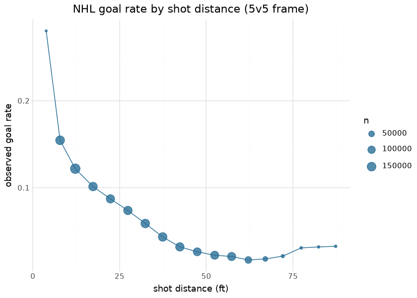
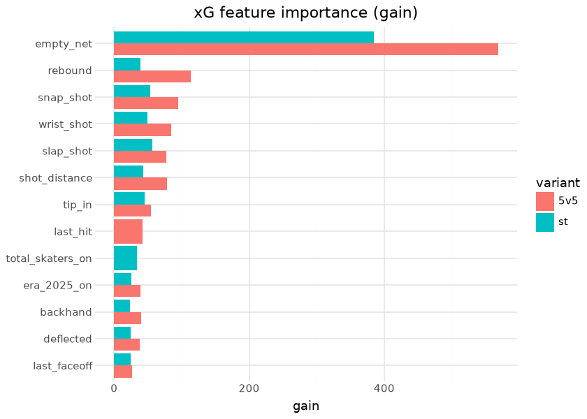
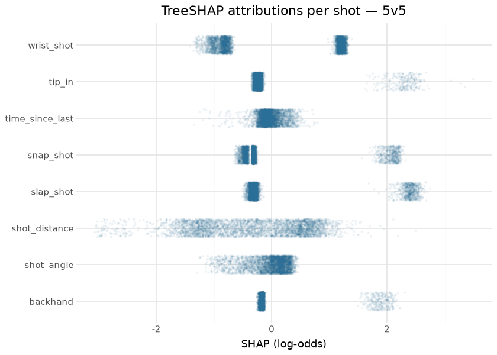
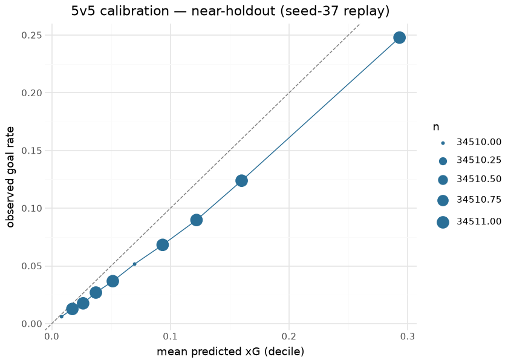
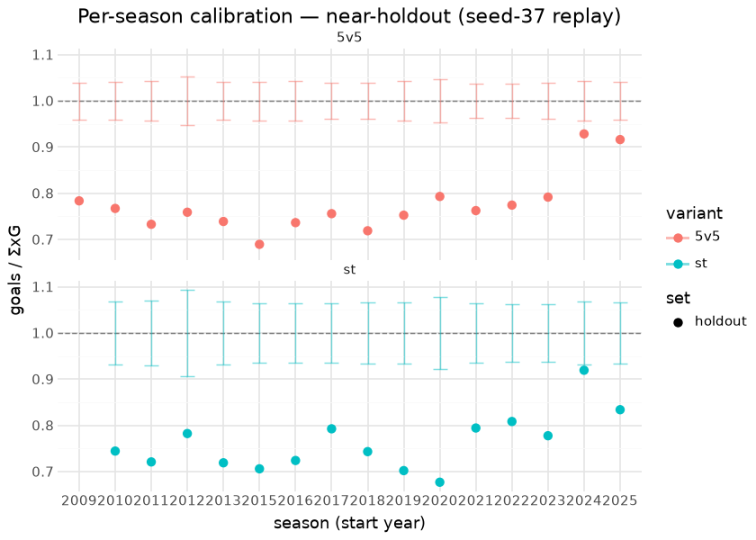

# NHL Expected Goals (fastRhockey xG suite)

The fastRhockey xG suite estimates the probability that an unblocked
shot becomes a goal, in two strength regimes: **5v5** (all non-shootout,
non-penalty-shot unblocked shots) and **special teams** (power play /
short-handed). A third component, the **penalty-shot constant**, is the
historical conversion rate computed at train time. The suite’s output
ships as the xG columns inside every published `nhl_pbp_full` season
asset — the model never ships alone; it reaches consumers embedded in
the play-by-play.

The models are XGBoost binary classifiers (logloss objective), a
faithful reproduction lineage of the hockeyR xG recipe (Morse 2022),
re-fit on this repository’s own committed corpus by
`python/nhl_data_build/xg_train.py` (canonical R twin
`R/build_xg_model.R`). The fitted boosters are **committed in this
repo** (`models/xg_model_{5v5,st}.json`) — that is the promotion step —
and every figure and number below is computed at render time from those
committed artifacts plus the committed play-by-play. The python trainer
also writes two sidecars beside the boosters, `xg_model_meta.json`
(feature lists, training-time CV and holdout metrics, per-season
calibration) and `xg_model_split.json` (the train/test `game_id`
partition); when they are committed the evaluation below scores the
*exact* held-out games, otherwise it replays the trainer’s split recipe
on today’s corpus and labels the result a near-holdout.

## Training data

| Committed NHL play-by-play corpus, by season |  |  |  |
|----|----|----|----|
| unblocked shot events (SHOT / MISSED_SHOT / GOAL); computed at render time |  |  |  |
| season | games | fenwick_events | goal_share |
| 20092010 | 1317 | 111,805 | 6.9% |
| 20102011 | 1318 | 112,525 | 6.7% |
| 20112012 | 1316 | 110,029 | 6.7% |
| 20122013 | 806 | 66,752 | 6.7% |
| 20132014 | 1323 | 112,057 | 6.7% |
| 20152016 | 1321 | 110,264 | 6.6% |
| 20162017 | 1317 | 111,712 | 6.6% |
| 20172018 | 1355 | 120,553 | 6.8% |
| 20182019 | 1358 | 118,441 | 7.0% |
| 20192020 | 1200 | 104,050 | 7.0% |
| 20202021 | 952 | 79,119 | 7.1% |
| 20212022 | 1401 | 122,350 | 7.3% |
| 20222023 | 1400 | 122,711 | 7.4% |
| 20232024 | 1400 | 123,136 | 7.1% |
| 20242025 | 1398 | 120,462 | 7.1% |
| 20252026 | 1394 | 120,154 | 7.4% |

&#10;

Training corpus: this repository’s committed play-by-play
(`nhl/pbp/parquet/`, seasons listed above, ~13.6M events). Seasons are
grouped into **five era buckets** (2011–2013, 2014–2018, 2019–2021,
2022–2024, 2025-on) that enter as one-hot features, so rule- and
tracking-era shifts are modeled rather than silently biasing the fit.
The 5v5/ST split is a modeling decision, not a convenience: shooting
talent and shot-quality distributions differ enough across strength
states that a single pooled model miscalibrates the power play.

## Exploratory data analysis

| Shot-type mix and conversion (5v5 frame) |         |           |
|------------------------------------------|---------|-----------|
| shot_type                                | shots   | goal_rate |
| wrist_shot                               | 864,283 | 6.6%      |
| slap_shot                                | 295,807 | 4.2%      |
| snap_shot                                | 259,008 | 7.7%      |
| backhand                                 | 129,096 | 8.6%      |
| tip_in                                   | 119,157 | 9.5%      |
| deflected                                | 36,344  | 9.6%      |
| wrap_around                              | 15,935  | 5.1%      |
| batted                                   | 1,824   | 12.1%     |
| poke                                     | 1,781   | 12.8%     |
| between_legs                             | 305     | 9.5%      |
| cradle                                   | 35      | 14.3%     |

&#10;

Distance dominates conversion — from ~25% at the crease to ~2% beyond 60
ft — and the shot-type table explains the one-hot block: tips and
deflections convert well above wrist shots from similar range, and the
model needs the type to separate them. The special-teams frame adds
`total_skaters_on` and `event_team_advantage`, the two features that
encode the man-advantage state.

## Feature importance

| Top 12 features by gain — 5v5 booster (committed artifact) |          |
|------------------------------------------------------------|----------|
| feature                                                    | gain_5v5 |
| empty_net                                                  | 568.4    |
| rebound                                                    | 113.9    |
| snap_shot                                                  | 94.6     |
| wrist_shot                                                 | 84.9     |
| shot_distance                                              | 78.8     |
| slap_shot                                                  | 77.0     |
| tip_in                                                     | 54.2     |
| last_hit                                                   | 42.6     |
| backhand                                                   | 40.2     |
| era_2025_on                                                | 39.3     |
| deflected                                                  | 38.3     |
| last_faceoff                                               | 27.0     |

&#10;

## SHAP

TreeSHAP attributions come directly from the committed boosters
(`pred_contribs=True` — exact for tree ensembles, no extra dependency).
The distribution of per-shot attributions for the top features shows how
each one moves individual shots on the log-odds scale:

| Mean \|SHAP\| — 5v5 booster, 4,000-shot sample |               |
|------------------------------------------------|---------------|
| feature                                        | mean_abs_shap |
| wrist_shot                                     | 1.0464        |
| shot_distance                                  | 0.8045        |
| slap_shot                                      | 0.6813        |
| snap_shot                                      | 0.6197        |
| tip_in                                         | 0.3785        |
| backhand                                       | 0.3012        |
| shot_angle                                     | 0.2365        |
| time_since_last                                | 0.1493        |

&#10;

## Evaluation

Two views, honestly labeled. First, the **training-time metrics**:
grouped 5-fold CV on the 80% side (the gated number) and the
game-grouped 20% holdout the fit never saw. They come from
`models/xg_model_meta.json` when a python sidecar is committed,
otherwise from the 2026-04 R fit’s console output as frozen in the
README (CV only — that run persisted no holdout metrics and no
partition, which is exactly what the sidecars fix). The gate floors are
frozen just below the 2026-04 values (5v5 cv AUC ≥ 0.82, ST ≥ 0.81) and
are never lowered; a real retrain below them fails (`--quick` smoke runs
tolerate misses).

**Sidecar state:** no python sidecar is committed yet — the committed
boosters are the 2026-04 R fit. The python trainer writes both sidecars
on every run, but its 2026-09-02 retrain on this repository’s parquet
frame fell below the frozen floors (special teams cv AUC **0.7569** vs ≥
0.81) and was not promoted (`models/ledger.jsonl`). Gates are never
lowered, so the sidecars land with the first passing retrain; until then
the evaluation below replays the trainer’s seed-37 game-grouped split on
today’s corpus and is a *near*-holdout — some evaluation games were in
the boosters’ training data.

| Training-time metrics |  |  |  |  |  |  |  |  |  |  |  |
|----|----|----|----|----|----|----|----|----|----|----|----|
| grouped 5-fold CV on the 80% side; game-grouped 20% holdout; floors frozen, never lowered |  |  |  |  |  |  |  |  |  |  |  |
| variant | source | train shots | holdout shots | holdout games | CV AUC | CV log-loss | holdout AUC | holdout log-loss | baseline log-loss | gate | passes |
| 5v5 | 2026-04 R fit (README; CV only) | — | — | — | 0.8322 | 0.2053 | — | — | — | cv AUC ≥ 0.82 | True |
| st | 2026-04 R fit (README; CV only) | — | — | — | 0.8213 | 0.2567 | — | — | — | cv AUC ≥ 0.81 | True |

&#10;

Second, the **held-out games re-scored at render time** by the committed
boosters. With a committed split file this is today’s corpus filtered to
the persisted `test_game_ids`; games that landed after the fit are in
neither list and are reported separately as **out-of-time** shots — an
honest forward test that grows as seasons land — and `Δ vs meta`
(render-time holdout AUC minus the meta’s) is exactly 0 unless the
committed play-by-play was repaired after the fit. Without a split file
the set is the seed-37 replay described above.

| Held-out evaluation — near-holdout (seed-37 replay) (render-time, current corpus) |  |  |  |  |  |  |  |  |
|----|----|----|----|----|----|----|----|----|
| seed-37 game-grouped 80/20 replay; committed boosters scored on the 20% side; 0 post-fit games in the out-of-time set |  |  |  |  |  |  |  |  |
| variant | set | shots | games | goal_rate | logloss | baseline_logloss | rank_AUC | Δ vs meta |
| 5v5 | near-holdout (seed-37 replay) | 345,108 | 4,116 | 6.8% | 0.2189 | 0.2488 | 0.7783 | — |
| st | near-holdout (seed-37 replay) | 69,967 | 3,815 | 10.2% | 0.2999 | 0.3293 | 0.7605 | — |
| 5v5 | out-of-time (post-fit games) | 0 | 0 | — | — | — | — | — |
| st | out-of-time (post-fit games) | 0 | 0 | — | — | — | — | — |

&#10;

The penalty-shot constant computed from the current corpus:

| Penalty-shot xG constant (historical conversion rate) |        |
|-------------------------------------------------------|--------|
| component                                             | xG     |
| penalty-shot / shootout constant                      | 0.3203 |

&#10;

## Per-season calibration drift

The special-teams sample is ~5× smaller than 5v5, so its AUC floor alone
cannot see a season whose *level* drifts — a rule or tracking change
that shifts conversion without reordering shots. The monitor is the
binomial calibration z-score per season,
`z = (goals − ΣxG) / sqrt(ΣxG · (1 − xG))`: a season the model prices
correctly has \|z\| ~ N(0, 1) whatever its shot count, which is what
makes `max |z|` comparable across seasons of unequal size. The trainer
records this table in `info_st.per_season_calibration` at every retrain
(`xg_train.per_season_calibration`), and stage `nhl_model_02_xg_st`
gates on `max |z| ≤ _ST_DRIFT_MAX_ABS_Z` — a ceiling derived from the
value observed on the exact holdout of the trusted retrain and never
raised (see `models/REGISTRY.md`). The same statistic is recomputed here
at render time on the held-out shots, with post-fit seasons appended as
out-of-time rows.

| Special-teams calibration by season — near-holdout (seed-37 replay) (+ out-of-time) |  |  |  |  |  |  |  |
|----|----|----|----|----|----|----|----|
| ratio = goals / ΣxG; z = binomial calibration z-score; auc = per-season rank AUC |  |  |  |  |  |  |  |
| set | season | n | goals | xg_sum | ratio | z | auc |
| holdout | 2010 | 5,106 | 473 | 635.4 | 0.744 | −7.53 | 0.763 |
| holdout | 2011 | 4,657 | 420 | 582.6 | 0.721 | −7.87 | 0.776 |
| holdout | 2012 | 2,852 | 269 | 343.9 | 0.782 | −4.69 | 0.731 |
| holdout | 2013 | 5,125 | 457 | 635.6 | 0.719 | −8.28 | 0.778 |
| holdout | 2015 | 4,808 | 470 | 665.8 | 0.706 | −9.22 | 0.766 |
| holdout | 2016 | 4,924 | 480 | 663.0 | 0.724 | −8.51 | 0.781 |
| holdout | 2017 | 5,095 | 539 | 680.0 | 0.793 | −6.53 | 0.764 |
| holdout | 2018 | 4,700 | 486 | 653.9 | 0.743 | −7.84 | 0.755 |
| holdout | 2019 | 4,353 | 440 | 626.7 | 0.702 | −9.09 | 0.762 |
| holdout | 2020 | 2,951 | 295 | 435.8 | 0.677 | −8.26 | 0.743 |
| holdout | 2021 | 5,017 | 535 | 673.5 | 0.794 | −6.32 | 0.758 |
| holdout | 2022 | 5,056 | 583 | 721.1 | 0.808 | −6.14 | 0.743 |
| holdout | 2023 | 5,104 | 555 | 713.7 | 0.778 | −7.08 | 0.758 |
| holdout | 2024 | 5,083 | 578 | 628.8 | 0.919 | −2.38 | 0.768 |
| holdout | 2025 | 5,136 | 551 | 660.8 | 0.834 | −5.00 | 0.755 |

&#10;

| Stage gates (nhl_model_02_xg_st.st_gates) |  |  |  |
|----|----|----|----|
| evaluated on the render-time near-holdout (seed-37 replay) |  |  |  |
| check | observed | threshold | pass |
| cv AUC ≥ 0.81 | n/a (no python meta) | 0.81 | n/a |
| ST drift: max \|z\| over held-out seasons ≤ ceiling | 9.218 | 3.0 | False |
| stage verdict |  |  | n/a |

&#10;

A booster calibrated to this frame sits inside the band in every season
it was trained on — the 2026-09-02 python special-teams retrain did (max
\|z\| 2.008 on its exact holdout, the observation that set the 3.0
ceiling). The committed 2026-04 R boosters do **not** on this frame (max
\|z\| 9.2 here): they score 25–30% too high on every season through
2023-24 and only 2024-25 / 2025-26 come close — a level miscalibration,
not drift, recorded under *Known issue* below. The drift ceiling has
teeth: it fails exactly this.

## Results — players and teams

| Top 15 skaters by 5v5 expected goals — season 2025-2026 |  |  |  |  |  |  |
|----|----|----|----|----|----|----|
| unblocked 5v5 shots scored by the committed booster; GAX = goals above expected |  |  |  |  |  |  |
|  | Player | Team | Shots | xG | G | GAX |
|  | Nathan MacKinnon | COL | 535 | 53.76 | 60 | 6.24 |
|  | Connor McDavid | EDM | 437 | 48.75 | 46 | −2.75 |
|  | Seth Jarvis | CAR | 382 | 44.53 | 35 | −9.53 |
|  | Cole Caufield | MTL | 434 | 43.90 | 56 | 12.10 |
|  | Kirill Kaprizov | MIN | 455 | 42.48 | 47 | 4.52 |
|  | Tage Thompson | BUF | 472 | 42.28 | 45 | 2.72 |
|  | Brandon Hagel | TBL | 343 | 42.01 | 41 | −1.01 |
|  | Juraj Slafkovský | MTL | 376 | 42.01 | 35 | −7.01 |
|  | Jason Robertson | DAL | 445 | 41.87 | 50 | 8.13 |
|  | Matt Boldy | MIN | 458 | 40.98 | 49 | 8.02 |
|  | Wyatt Johnston | DAL | 325 | 40.60 | 49 | 8.40 |
|  | Alex DeBrincat | DET | 431 | 40.24 | 40 | −0.24 |
|  | Tomas Hertl | VGK | 383 | 40.10 | 29 | −11.10 |
|  | Pavel Dorofeyev | VGK | 422 | 38.65 | 49 | 10.35 |
|  | Nikita Kucherov | TBL | 421 | 38.48 | 43 | 4.52 |

&#10;

| Team 5v5 shot generation — season 2025-2026 |       |        |           |       |
|---------------------------------------------|-------|--------|-----------|-------|
| team                                        | shots | xG_for | goals_for | GAX   |
| CAR                                         | 5,070 | 401.3  | 347       | −54.3 |
| COL                                         | 4,700 | 364.2  | 331       | −33.2 |
| VGK                                         | 4,452 | 358.0  | 331       | −27.0 |
| MTL                                         | 3,995 | 344.4  | 323       | −21.4 |
| BUF                                         | 4,090 | 331.3  | 322       | −9.3  |
| ANA                                         | 4,429 | 325.8  | 295       | −30.8 |
| TBL                                         | 3,815 | 315.4  | 291       | −24.4 |
| EDM                                         | 3,775 | 311.6  | 295       | −16.6 |
| MIN                                         | 4,061 | 309.9  | 304       | −5.9  |
| OTT                                         | 3,739 | 301.8  | 274       | −27.8 |
| PIT                                         | 3,823 | 296.9  | 295       | −1.9  |
| UTA                                         | 3,753 | 291.5  | 277       | −14.5 |
| PHI                                         | 3,483 | 289.9  | 250       | −39.9 |
| DAL                                         | 3,280 | 287.2  | 285       | −2.2  |
| WSH                                         | 3,496 | 280.4  | 254       | −26.4 |
| NJD                                         | 3,587 | 275.8  | 223       | −52.8 |
| DET                                         | 3,515 | 273.5  | 235       | −38.5 |
| CBJ                                         | 3,547 | 273.2  | 241       | −32.2 |
| LAK                                         | 3,694 | 272.4  | 221       | −51.4 |
| BOS                                         | 3,646 | 272.3  | 274       | 1.7   |
| FLA                                         | 3,577 | 267.3  | 233       | −34.3 |
| NYI                                         | 3,475 | 265.4  | 224       | −41.4 |
| NSH                                         | 3,444 | 258.6  | 239       | −19.6 |
| WPG                                         | 3,296 | 252.4  | 225       | −27.4 |
| TOR                                         | 3,216 | 252.3  | 245       | −7.3  |
| STL                                         | 3,049 | 249.3  | 223       | −26.3 |
| SJS                                         | 3,077 | 247.6  | 244       | −3.6  |
| VAN                                         | 3,291 | 243.4  | 206       | −37.4 |
| NYR                                         | 3,251 | 241.1  | 232       | −9.1  |
| SEA                                         | 3,194 | 241.0  | 218       | −23.0 |
| CGY                                         | 3,354 | 237.4  | 203       | −34.4 |
| CHI                                         | 3,063 | 231.3  | 206       | −25.3 |

&#10;

Positive GAX marks finishing above shot quality. At the team level,
xG-for minus goals-for separates shot-generation strength from shooting
luck — the spread between the two is exactly what the embedded xG
columns in `nhl_pbp_full` exist to expose.

## Provenance & reproducibility

- **Trained on:** this repository’s committed play-by-play
  (`nhl/pbp/parquet/`, seasons in the corpus table above); committed
  boosters = the 2026-04 fit; grouped 80/20 split by `game_id`, grouped
  5-fold CV for `min_child_weight`, seed 37 (the python trainer persists
  the partition in `models/xg_model_split.json`).
- **Artifacts:** `models/xg_model_5v5.json`, `models/xg_model_st.json`
  (committed — the promotion step); python sidecars
  `models/xg_model_meta.json` (feature lists, CV + exact-holdout
  metrics, per-season calibration, PS constant) and
  `models/xg_model_split.json`, committed with the first gate-passing
  python retrain; every stage run appends a `models/ledger.jsonl` line
  (including failed ones). Output ships inside `nhl_pbp_full`.
- **Retrain:** `scripts/nhl_models.sh` (stages `nhl_model_01_xg_5v5` /
  `nhl_model_02_xg_st`; fingerprint-skipped when unchanged, `--force` to
  retrain); gates frozen in `models/manifest.yaml` (cv AUC floors + the
  ST per-season drift ceiling), registry row in `models/REGISTRY.md`.
- **Rebuild this document:** `scripts/render_model_docs.sh` (Quarto →
  GFM; uses this repo’s `.venv` via `QUARTO_PYTHON`;
  `uv sync --group docs --group train`).

## Avenues for improvement & open issues

- **Pre-shot context** — rush/rebound flags exist, but passing sequences
  and screens do not; public-feed models plateau here, so the honest
  gain is better rebound/rush definitions, not more trees.
- **Blocked by a gate (2026-09-01, PR \#7):**
  *Commit the python meta sidecar* — the trainer now writes
  `models/xg_model_meta.json` with the exact training-time CV/holdout
  metrics and this document reads it when present, but the 2026-09-02
  python retrain on this repository’s parquet frame fell below the
  frozen floors (special teams cv AUC **0.7569** vs ≥ 0.81) and was not
  promoted (`models/ledger.jsonl`); the 5v5 stage of that attempt was
  not run to completion. Gates are never lowered; the sidecar lands with
  the first passing retrain.
- **Blocked by the same gate (2026-09-01, PR \#7):**
  *Exact holdout reproduction* — `models/xg_model_split.json`
  (train/test `game_id` partition) is written by every python retrain
  and this document switches to the exact holdout automatically when it
  is committed; until then the evaluation is the labeled near-holdout
  replay.
- **Resolved (2026-09-01, PR \#7):** *Per-season ST
  calibration drift* — monitored by the per-season table and figure
  above; the trainer records the statistic in the meta and stage
  `nhl_model_02_xg_st` gates on the observed-value-derived ceiling
  `max |z| ≤ _ST_DRIFT_MAX_ABS_Z`.
- **Known issue (measured 2026-09-01):** the committed 2026-04 R-trained
  boosters, scored through this repository’s python feature frame,
  over-predict goals by 25–30% on every season through 2023-24
  (goals/ΣxG 0.68–0.81; \|z\| up to 14.8 for 5v5 and 9.2 for ST on the
  seed-37 near-holdout) while 2024-25 and 2025-26 sit at 0.92–0.93, and
  their near-holdout AUC is 0.778/0.761 against the fit’s 0.832/0.821. A
  python booster trained on this same frame is calibrated per season (ST
  max \|z\| 2.008) but tops out at the same discrimination (ST cv AUC
  0.7569), so the deficit is in the **frame**, not the booster: the R
  training frame and the python frame disagree for pre-2024 seasons.
  That is an R↔Python parity question (handed to `sdv-parity-reviewer`),
  not a modeling one, and it blocks promoting any python retrain until
  resolved.
