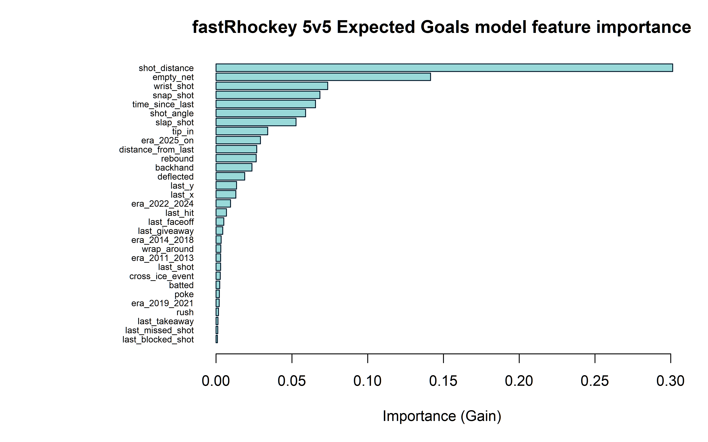
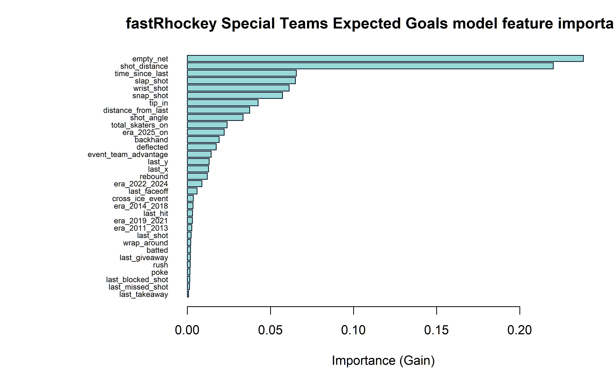
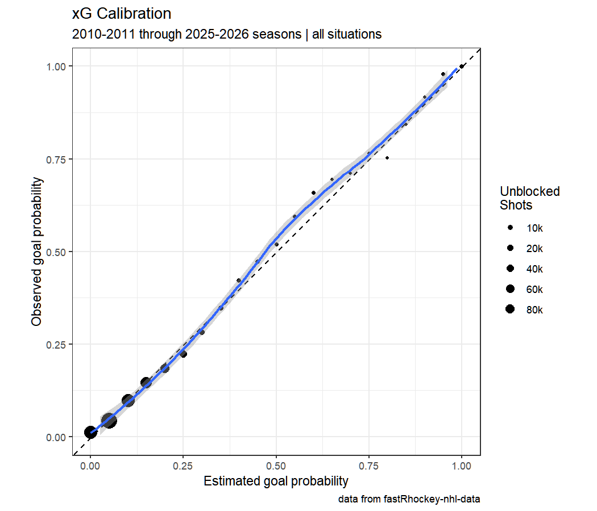
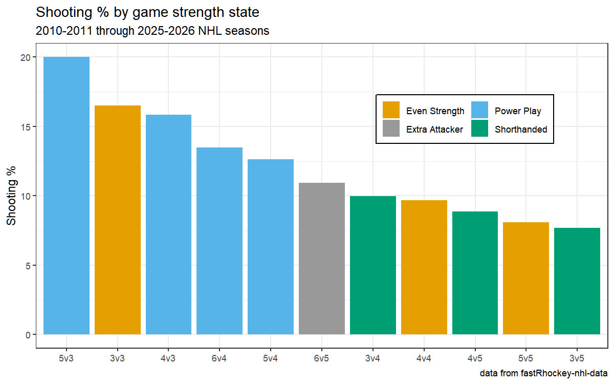

# NHL Expected Goals (fastRhockey xG suite)

## Overview

The fastRhockey xG suite estimates the probability that an unblocked shot
becomes a goal, in two strength regimes: **5v5** (all non-shootout,
non-penalty-shot unblocked shots) and **special teams** (power play /
short-handed). A third component, the **penalty-shot constant**, is a single
empirical conversion rate derived at train time. The suite's output ships as
the xG columns inside every published `nhl_pbp_full` season asset — the model
never ships alone; it reaches consumers embedded in the play-by-play.

Provenance: a faithful reproduction lineage of the hockeyR xG recipe
(Morse 2022), re-fit on this repo's own 16-season corpus with two trainers
sharing one recipe — `R/build_xg_model.R` (canonical) and its python port
`python/nhl_data_build/xg_train.py` (per-variant selectable since 2026-09-01:
`--variant {5v5,st,both}`; single-variant retrains merge into the shared
`xg_model_meta.json` rather than clobbering the sibling's entries).

## Data & feature engineering

Training corpus: this repo's committed NHL play-by-play
(`nhl/pbp/parquet/*.parquet`, 16 seasons 2010-11 → 2025-26, ~530 MB), grouped
into **five era buckets** so rule/tracking-era shifts enter as features rather
than silently biasing the fit. Features are era-derived at train time (shot
geometry — distance/angle from x,y — shot type, strength context, rebound and
rush indicators, era one-hots); the authoritative per-retrain feature lists
are recorded in `xg_model_meta.json` rather than a code constant, because the
era grouping makes the list data-dependent.

The 5v5/ST split is a modeling decision, not a convenience: shooting talent
and shot quality distributions differ enough across strength states that a
single pooled model miscalibrates the power play.

## Model & training

XGBoost binary classifiers (logloss objective), one booster per variant, with
a `min_child_weight` grid selected by cross-validated logloss on a **grouped
80/20 split — grouped by game**, so no game contributes shots to both train
and test (the leakage split a random shot-level split would create).

## Evaluation

Gate floors are frozen just below the 2026-04 observed values and are never
lowered (`--quick` smoke runs tolerate misses; a real retrain does not):

| variant | CV AUC (observed) | CV log-loss | frozen floor |
|---|---|---|---|
| 5v5 | **0.8322** | 0.2053 | cv AUC ≥ 0.82 |
| special teams | **0.8213** | 0.2567 | cv AUC ≥ 0.81 |

Grouped-split holdout metrics, the penalty-shot constant, and top-15 gain
feature importances are re-recorded in `xg_model_meta.json` +
`xg_model_report.md` on every retrain (stages `nhl_model_01_xg_5v5` /
`nhl_model_02_xg_st`, each appending `models/ledger.jsonl`).

## Figures

Feature importance (gain), committed per variant:





Calibration and team/player xG summaries are rendered in the README pipeline:





## Limitations

Public NHL feeds carry no pre-shot passing or screen data, so xG here is a
location/type/context model — it will under-rate royal-road one-timers and
over-rate screened point shots relative to tracking-data models. The
special-teams sample is an order of magnitude smaller than 5v5, which is why
its gate floor sits lower. Era buckets absorb secular scoring drift but not
mid-season rule enforcement changes.

## Reproducibility

```sh
scripts/nhl_models.sh            # both variants, fingerprint-skipped when unchanged
scripts/nhl_models.sh 01 --force # retrain 5v5 alone; meta merges
```

Artifacts (`models/xg_model_{5v5,st}.json`) are COMMITTED in this repo — that
is the promotion step — and their output ships inside `nhl_pbp_full`.
Registry row: `models/REGISTRY.md`; stage list: `models/manifest.yaml`.

## Avenues for improvement & open issues

- **Pre-shot context** — rush/rebound flags exist, but passing sequence and
  screen data do not; public-feed models plateau here, so the honest gain is
  better rebound/rush definitions, not more trees.
- **Commit the python meta sidecar** — `xg_model_meta.json` (feature lists +
  per-retrain metrics) is regenerated per run but only the R-era `.rds` is
  committed; committing the json would version the feature lists.
- **Known issue:** the ST sample is ~10x smaller than 5v5 — its gate floor is
  lower for that reason, and per-season ST calibration drift is unmonitored.
